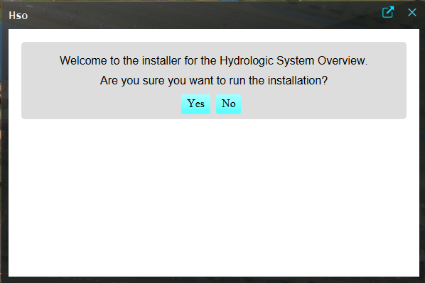

# Why a Hydrological System Overview (HSO)?
The development of hydrological models typically follows several steps. First, the model is set up by adding the relevant data to the software. After this, an initial simulation can be run to evaluate the results. Often, the model will not yet perform as intended. In that case, adjustments are required. Sometimes better input data is needed, or calibration steps must be taken to improve parameter values. When a simulation does produce the expected outcomes, the base model is considered ready. From that point onward, different scenarios can be evaluated.

The goal of the HSO is to simplify the process of test-running and calibrating a model. In any model, and especially in a raster-based model with many adjustable parameters, it is essential to maintain a clear understanding of what is happening internally. The HSO provides insight into the hydrological system itself, the water balance, and the functioning of all hydraulic structures. This contributes to better control and a deeper understanding of the model.

When the base model meets expectations and scenario simulations begin, it once again becomes crucial to understand what the results represent. At this stage too, the HSO supports the modeller in interpreting the outcomes.

The HSO is explicitly not intended for adjusting values. It functions as a thermometer that reflects what is currently present in the model.

# What is the HSO?

The HSO consists of two main components:
- Water balance
- Structures

## Water Balance
The water balance consists of the following components:

- Water Balance Table
- Volume Plot
- Flow Table
- Sankey Diagram

### Water Balance Table
The Water Balance Table shows the volume of water present in the different water storage compartments of the model per time step for the area to which the HSO is linked.
These values represent the amount of water present at the end of a given time step.

### Volume Plot
The Volume Plot is a bar chart representation of the Water Balance Table. Using the slider, different time steps can be explored.

### Flow Table
The Flow Table is a more detailed table than the Water Balance Table. It shows the different flows that occurred during a time step between the different water storage compartments. These are volumes per time step.

### Sankey Diagram
The Sankey Diagram visualizes how water flows through the system. It shows from which water storage compartment the water flows to the next storage compartment. 
This also includes Area In and Area Out, representing the aggregated inflow to and outflow from the area associated with the HSO.
Using the slider, different time steps can be explored.

For a complete overview of all possible flows in Tygron, see this HTML reference: [placeholder].

## Structures
The HSO provides access to different types of hydrological structures present in the area to which it is linked.  
All structure types follow the same information layout.

For each structure, the following sections are available:

- Parameters  
- Results  
- Details  
- Formula  

### Parameters
This table displays the parameters configured in the model for the selected structure type. 
Only the parameters of structures located within the area to which the HSO is linked are displayed.

### Results
This table presents the calculated results for the selected structure type. These results are derived from the model simulation and reflect the hydraulic behaviour of the structures during the selected time step.

Only results for structures within the area linked to the HSO are shown.

### Details
The Details section provides additional contextual and descriptive information about each structure, such as identification attributes.
In addition, a front view and side view of the structure are displayed. Using a time-step slider, water levels can be inspected for each time step in relation to the structure.

### Formula
The Formula section embeds the corresponding Tygron Wiki page, which serves as the authoritative reference for the equations and calculation logic used to determine the results for the selected structure type.

### Available Structure Types

- Culverts  
- Weirs  

# How to install the HSO
The HSO Dashboard is installed using the HSO Plugin that can be found on the public geoshare.

1. Start the Tygron Client Application, log in, and load an existing project or create a new project.

2. Open the GeoShare:  
   Click on `GeoShare` in the ribbon bar  
   Or select `Current Situation > Geo Import > Show GeoShare`

3. Public Share
   - Switch to **Public Share**, found in the top-right section of the GeoShare panel.

     
   - Open the folder named **plugins**  
   - Double click the file named `hso.txt` to inspect it
   - Click **Import**  
   - Read and accept the disclaimer
   - Select the option **Import Text Panel**

4. With the HSO panel added to your project, click on Open Panel to start the HSO installer.
   The primary purpose of the installer is to create the required overlays and to link the dashboard to an area. The installer is designed to be idempotent: regardless of whether the required overlays already exist, it ensures that all overlays needed for the HSO are present and correctly configured.
   Each HSO is always linked to a single area. A project may contain multiple HSO dashboards, but each dashboard has a one-to-one relationship with an area. The installer assists in selecting and linking the correct area, ensuring that the HSO is always connected to the intended area.
   If no areas are present in the project, the installer can create a dummy area. This area has no geometry.
   To obtain meaningful results, geometry must be assigned to this area before the HSO will display relevant data.
   Once the installation of the HSO is complete, you can close the installer by clicking the **Finish** button. 
   The first HSO Dashboard will then be selected and opened in the editor.

  
5. To open and inspect a HSO Dashboard, 
   - Navigate to `Current Situation > Panels` 
   - Select a panel starting with **Hydrological System Overview:**, followed by the name of the linked Water Level Area.
   - Click on **Open Panel** in its detail panel.

# Areas linked to HSO Dashboard
   The HSO installer adds a Template Text Panel that manages the content of the HSO Dashboard, as well as the instances that will be created. 
   By default the HSO Dashboard is applied on Areas, identified by the attribute that was selected in the installer.
   To inspect and adjust these settings, select the Template Text Panel named **Hydrological System Overview**. 
   

   On the right side you see the panel Body. Now select the tab **Template** and in the right bottom corner you will see to which attribute the HSO is linked. If you want you can select a different attribute here, but you could also use the installer to do this.  

   Optionally, click the browser icon next to the close button to open the panel in your web browser.

## Area and overlays

The HSO is linked to a specific area. It provides information exclusively about the water balance and the hydraulic structures in relation to this area. It does not contain information outside the defined area.

In addition, the HSO is linked to a single Water Overlay.

Once the HSO is installed for a certain overlay, this overlay will have a new attribute: HSO_WATER_OVERLAY with an attributre values of 1. In case you switch the HSO with the installer to a different overlay, this attribute will be deleted. If you change the value to 0, the overlay will not be used for the HSO.

### Required overlays

All required overlays are automatically created by the installer.

The HSO currently requires the following result type overlays:
- Surface Last Value
- Building Last Storage
- Rainfall
- Groundwater Last Storage
- Sewer Last Value
- Evapotranspiration
- Surface Transpiration
- Base Typology
- Groundwater Last Unsaturated Storage

In addition, several additional combo overlays are added that splits result overlays between land and water:
- Surface Last Value Water
- Rainfall Water
- Rainfall Land
- Evaporation Water
- Evaporation Land

# The HSO compared to the Waterbalance in the Client
In the client, a water balance is also available. This panel also presents a water balance, but it is primarily focused on visualizing the error that has occurred in the calculation. It does show total quantities, but these are not available per time step, for example. For this reason, users expressed the need for a more detailed overview.

# Requirements

- **Tygron Platform** version **2025 or newer**
- The **2024 LTS** version is **not supported**

# Licensing
The overview is released under the MIT License. This means that you are free to use, modify, and distribute the software, provided that the original copyright notice and license text are included in any copies or substantial portions of the software.

MIT License

Copyright (c) 2025 Tygron

Permission is hereby granted, free of charge, to any person obtaining a copy
of this software and associated documentation files (the "Software"), to deal
in the Software without restriction, including without limitation the rights
to use, copy, modify, merge, publish, distribute, sublicense, and/or sell
copies of the Software, and to permit persons to whom the Software is
furnished to do so, subject to the following conditions:

The above copyright notice and this permission notice shall be included in all
copies or substantial portions of the Software.

THE SOFTWARE IS PROVIDED "AS IS", WITHOUT WARRANTY OF ANY KIND, EXPRESS OR
IMPLIED, INCLUDING BUT NOT LIMITED TO THE WARRANTIES OF MERCHANTABILITY,
FITNESS FOR A PARTICULAR PURPOSE AND NONINFRINGEMENT. IN NO EVENT SHALL THE
AUTHORS OR COPYRIGHT HOLDERS BE LIABLE FOR ANY CLAIM, DAMAGES OR OTHER
LIABILITY, WHETHER IN AN ACTION OF CONTRACT, TORT OR OTHERWISE, ARISING FROM,
OUT OF OR IN CONNECTION WITH THE SOFTWARE OR THE USE OR OTHER DEALINGS IN THE
SOFTWARE.
